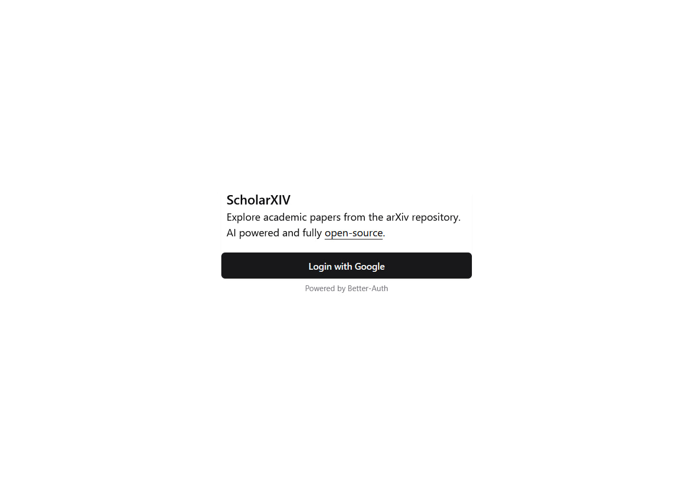
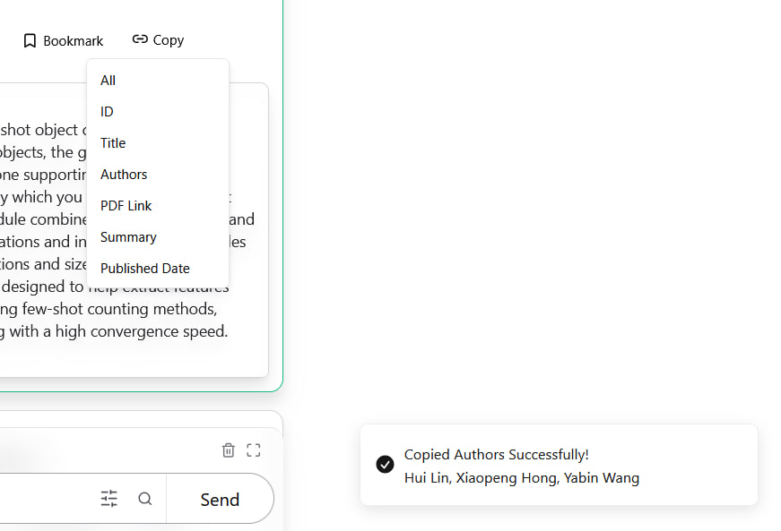

# [ScholarXIV](https://scholarxiv.com)

A modern, AI-powered academic research platform that helps you discover, analyze, and interact with research papers more efficiently.

## Features

- **Smart Search** - Find relevant papers with powerful search capabilities
- **Advanced Filters** - Refine your search with advanced filtering options
- **Context-Aware Chat** - Chat with an AI assistant about research papers
- **Multi-Paper Analysis** - Select and compare multiple papers in a single chat session
- **Save & Organize** - Like and bookmark papers for later reference
- **Comment** - comment and view discussions about papers
- **Collections** - View and manage your liked and bookmarked papers
- **In-Browser Viewing** - Read papers directly in your browser
- **Download Options** - Download papers in PDF format

### Technologies Used

- **Frontend**: SvelteKit, TypeScript, Tailwind CSS
- **Backend**: MongoDB
- **AI**: Gemini

### Self Hosting Guide

1. Clone the repository
2. Install dependencies: `npm install`
3. Set up environment variables (refer to `.env.example`)
4. Run the development server: `npm run dev`
5. Open [http://localhost:5173](http://localhost:5173) in your browser

### How to Contribute

We welcome contributions from the community! Follow these steps to contribute:

1. **Fork the Repository**: Fork the ScholarXIV repository to your GitHub account.
2. **Make Changes**: Create a new branch, make your changes, and commit them to your branch.
3. **Create a Pull Request**: Once your changes are ready, create a detailed pull request (PR) explaining the changes you've made.
4. **Review and Iterate**: Collaborate with the maintainers to review and iterate on your changes until they are ready to be merged.
5. **That's it!**: Can't wait to see the wonders you'll be doing.

For more detailed guidelines on contributing, please refer to our contribution guidelines.

## Screenshots

|                                          |                                          |
| ---------------------------------------- | ---------------------------------------- |
|   |   |
|   |   |
|   |   |
|   |   |
|   |  |
|  |  |

## License

This project is licensed under the GPL-3.0 License - see the [LICENSE](LICENSE) file for details.

## Contributing

Contributions are welcome! Please feel free to submit a Pull Request.

## Contact

Have questions or suggestions? Feel free to open an issue or reach out to our team.
